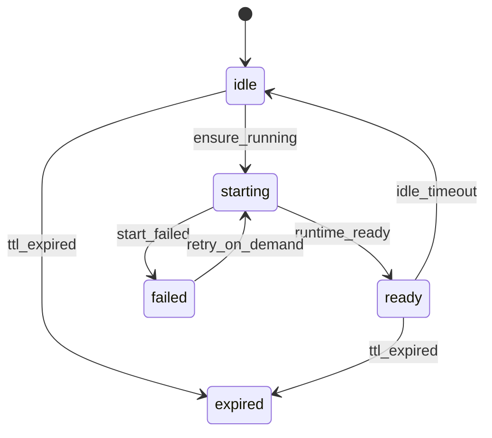

# Bay REST API v1 设计草案

> 本文聚焦“API 契约与一致性”：版本化、幂等、分页、错误模型、状态机、端点定义。
>
> 设计背景与概念模型参见：[plans/bay-design.md](plans/bay-design.md:1)。

## 0. 总览

### 0.1 版本化

- 所有对外 REST API 使用路径前缀版本：`/v1/...`
- 同一 major 版本内仅做向后兼容的增量（可新增字段/端点；不删除字段/不改变字段语义）。

### 0.2 对外资源抽象

- 对外唯一必需资源：`Sandbox`
- `Session` 不对外暴露（仅内部运行实例）
- `Workspace` 为可选的高级/管理面资源（可能受更高权限 scope 控制）

对应理念与生命周期规则参见：[plans/bay-design.md](plans/bay-design.md:128)。

### 0.3 标准 Header

- 鉴权：`Authorization: Bearer <token>`（见：[plans/bay-design.md](plans/bay-design.md:372)）
- 请求追踪：
  - 客户端可传：`X-Request-Id: <uuid>`
  - 服务端必须回传：`X-Request-Id`
- 幂等键（仅对明确声明支持的端点）：`Idempotency-Key: <opaque-string>`

## 1. 幂等与重试语义

### 1.1 适用范围

- **支持幂等键**：
  - [`POST /v1/sandboxes`](plans/bay-api.md:1)（创建 Sandbox）
- **天然幂等**：
  - `GET`/`LIST` 查询类
  - `DELETE /v1/sandboxes/{id}`（彻底销毁；若资源不存在返回 404，见错误模型约定）
  - `POST /v1/sandboxes/{id}/stop`（只回收算力；重复调用应返回 200 且保持最终状态一致）

### 1.2 `Idempotency-Key` 规则

- 语义：同一 `owner` + 同一 `Idempotency-Key` + 同一路径/方法 +（可选）同一请求体哈希 → 返回同一结果
- 服务端存储：
  - 记录 `key`、`request_fingerprint`、`response_snapshot`、`status_code`、`created_at`、`expires_at`
  - 冲突：同一 key 但 fingerprint 不同 → 返回 `409 conflict`
- 有效期：建议至少覆盖客户端重试窗口（具体值由实现配置）

### 1.3 客户端重试建议

- 可重试：
  - 网络超时、连接失败
  - `503 session_not_ready`（服务端告知正在启动）
  - `502 ship_error`（短暂性下游错误，需谨慎）
- 不建议自动重试：
  - `4xx` 参数/权限错误
  - 语义可能产生副作用且未声明幂等的端点

## 2. 分页、过滤与排序

适用：`GET /v1/sandboxes`、`GET /v1/workspaces` 等列表接口。

### 2.1 请求参数

- `limit`：默认 50，最大 200
- `cursor`：游标字符串（由服务端生成）
- `order_by`：枚举，如 `created_at`、`last_active_at`
- `order`：`asc` | `desc`
- `filter`：若需要，建议拆成明确字段（例如 `status=running`），避免引入复杂 DSL

### 2.2 响应格式

```json
{
  "items": [],
  "next_cursor": null
}
```

## 3. 统一错误模型

文档中的错误类型见：[plans/bay-design.md](plans/bay-design.md:540)。此处定义 HTTP 响应体规范与映射。

### 3.1 统一错误响应体

```json
{
  "error": {
    "code": "session_not_ready",
    "message": "session is starting",
    "request_id": "...",
    "details": {
      "sandbox_id": "sandbox-abc123",
      "retry_after_ms": 1000
    }
  }
}
```

- `code`：稳定枚举，用于程序化处理
- `message`：面向人类的说明（可国际化，非稳定）
- `details`：可选，结构化调试信息（不得包含敏感信息）

### 3.2 错误码映射建议

| error.code | 对应异常 | HTTP | 说明 |
|---|---:|---|
| `not_found` | `NotFoundError` | 404 | 资源不存在或不可见 |
| `unauthorized` | `UnauthorizedError` | 401 | 未认证 |
| `forbidden` | `ForbiddenError` | 403 | 无权限 |
| `quota_exceeded` | `QuotaExceededError` | 429 | 配额/限流 |
| `session_not_ready` | `SessionNotReadyError` | 503 | 正在启动/重建 |
| `timeout` | `TimeoutError` | 504 | 执行超时 |
| `ship_error` | `ShipError` | 502 | 下游运行时错误 |
| `conflict` | - | 409 | 幂等键冲突/状态冲突 |
| `validation_error` | - | 400 | 参数校验错误 |

### 3.3 `Retry-After`

- 对 `503 session_not_ready` 可以返回 `Retry-After: <seconds>`（可选）

## 4. 状态机与可观测状态

### 4.1 Sandbox 聚合状态

建议对外 `Sandbox.status` 使用聚合状态，而不是直接暴露内部 `SessionStatus`（见：[plans/bay-design.md](plans/bay-design.md:83)）。

推荐枚举：
- `idle`：无运行实例（仅 workspace）
- `starting`：正在创建/启动运行实例
- `ready`：运行实例就绪（运行时健康检查通过）
- `failed`：最近一次启动失败（可重试）
- `expired`：Sandbox TTL 到期，不可恢复
- `deleted`：仅作为内部终态（对外资源将 404）



> Mermaid 注意：方括号内不使用双引号与括号。

### 4.2 时间字段

所有 `Sandbox` 查询响应建议同时返回：
- `expires_at`：Sandbox TTL 到期时间（无限期为 `null`）
- `idle_expires_at`：当前运行实例 idle 到期时间（无运行实例为 `null`）

语义参见：[plans/bay-design.md](plans/bay-design.md:110)。

## 5. 资源模型（v1）

### 5.1 Sandbox

```json
{
  "id": "sandbox-abc123",
  "status": "ready",
  "profile": "python-default",
  "workspace_id": "ws-xyz789",
  "capabilities": ["filesystem", "shell", "ipython"],
  "created_at": "2026-01-28T06:00:00Z",
  "expires_at": null,
  "idle_expires_at": "2026-01-28T06:30:00Z"
}
```

### 5.2 Workspace（高级/管理面）

```json
{
  "id": "ws-xyz789",
  "managed": true,
  "managed_by_sandbox_id": "sandbox-abc123",
  "size_limit_mb": 1024,
  "created_at": "2026-01-28T06:00:00Z",
  "last_accessed_at": "2026-01-28T06:10:00Z"
}
```

## 6. 端点定义

以下端点均位于 `/v1` 下。

### 6.1 Sandbox 管理

#### 6.1.1 创建 Sandbox

- `POST /v1/sandboxes`
- Header：可选 `Idempotency-Key`

Request:
```json
{
  "profile": "python-default",
  "workspace_id": null,
  "ttl": 3600
}
```

Response: `201`
```json
{
  "id": "sandbox-abc123",
  "status": "idle",
  "profile": "python-default",
  "workspace_id": "ws-xyz789",
  "capabilities": ["filesystem", "shell", "ipython"],
  "created_at": "...",
  "expires_at": "...",
  "idle_expires_at": null
}
```

语义：
- 可懒启动运行实例：创建时 `status` 允许为 `idle`
- `ttl=null` 或 `ttl=0` 表示不过期（见：[plans/bay-design.md](plans/bay-design.md:114)）

#### 6.1.2 查询 Sandbox

- `GET /v1/sandboxes/{id}`

Response: `200`（见资源模型）

#### 6.1.3 列出 Sandboxes

- `GET /v1/sandboxes?limit=...&cursor=...&status=...`

Response: `200`
```json
{
  "items": [/* Sandbox */],
  "next_cursor": null
}
```

#### 6.1.4 Keepalive

- `POST /v1/sandboxes/{id}/keepalive`

语义：
- 只延长 `idle_expires_at`，不改变 `expires_at`
- 若无运行实例：建议只更新访问时间，不隐式启动算力（见：[plans/bay-design.md](plans/bay-design.md:120)）

Response: `200`

#### 6.1.5 Stop（仅回收算力）

- `POST /v1/sandboxes/{id}/stop`

语义：
- 停止并销毁该 sandbox 下**所有**运行实例（当前可能只有 0/1 个；为未来多实例预留），保留 `Sandbox` 与 `Workspace`
- 幂等：重复调用保持最终状态一致

Response: `200`

#### 6.1.6 Delete（彻底销毁 Sandbox）

- `DELETE /v1/sandboxes/{id}`

语义：
- 销毁所有运行实例
- 若绑定 Workspace 为 `managed`：**强制级联删除** workspace
- 若绑定 Workspace 为 `external`：不级联删除

Response: `204`

### 6.2 Capability 调用（通过 Sandbox 路由）

> 这些端点的共同语义：Bay 可在请求开始时执行 `ensure_running`，必要时自动创建/重建运行实例。
>
> 若运行实例尚未就绪：返回 `503 session_not_ready`，并可附带 `Retry-After`。

#### 6.2.1 Filesystem（RESTful 风格）

> **统一使用 `/filesystem/` 前缀，包含 6 个操作原语**

- `GET /v1/sandboxes/{id}/filesystem/files?path=...` — 读取文件
- `PUT /v1/sandboxes/{id}/filesystem/files` — 写入文件（body: `{path, content}`）
- `DELETE /v1/sandboxes/{id}/filesystem/files?path=...` — 删除文件或目录
- `GET /v1/sandboxes/{id}/filesystem/directories?path=.` — 列出目录
- `POST /v1/sandboxes/{id}/filesystem/upload` — 上传二进制文件 (multipart)
- `GET /v1/sandboxes/{id}/filesystem/download?path=...` — 下载文件

路径语义（强约束）：
- 所有路径参数必须是相对路径（相对容器内 workspace 根目录 `/workspace`）
- 禁止绝对路径与目录穿越（例如 `../`）

约束：
- 与 Workspace 直读写（6.3）相比，此处属于“通过运行时访问”，更适合与执行环境一致的权限/审计。

#### 6.2.2 Shell

- `POST /v1/sandboxes/{id}/shell/exec`
- `GET /v1/sandboxes/{id}/shell/processes`

#### 6.2.3 Python

- `POST /v1/sandboxes/{id}/python/exec`

### 6.3 Workspace 数据面（高级/管理面）

> 直读写不需要启动运行实例，但需要更严格的权限控制与审计。

- `POST /v1/workspaces`
- `GET /v1/workspaces`
- `GET /v1/workspaces/{id}`
- `DELETE /v1/workspaces/{id}`
- `POST /v1/workspaces/{id}/files/read`
- `POST /v1/workspaces/{id}/files/write`

#### 6.3.1 与 Sandbox 文件接口的边界

- `Sandbox /files/*`：面向“执行环境一致性”，默认开放给普通调用方
- `Workspace /files/*`：面向“数据面管理”，建议：
  - 需要更高权限 scope（例如 admin 或 service integration）
  - 必须记录审计日志
  - 并发写入策略：v1 采用“最后写入覆盖”，由用户在应用层自行控制并发写入（后续可新增可选的版本号/ETag 机制用于冲突检测）

## 7. 待定问题（需要在实现前拍板）

- `DELETE /v1/workspaces/{id}` 对 managed workspace 的规则：
  - 允许在 `managed_by_sandbox_id` 对应 sandbox 已彻底删除的情况下删除（Bay DB 采用软删除 tombstone，保留 `deleted_at`/retention，用于幂等、审计与判定）。
  - 若 sandbox 仍存在（未 deleted），删除该 managed workspace 应返回 `409 conflict` 或 `403 forbidden`（实现前需确定）。
