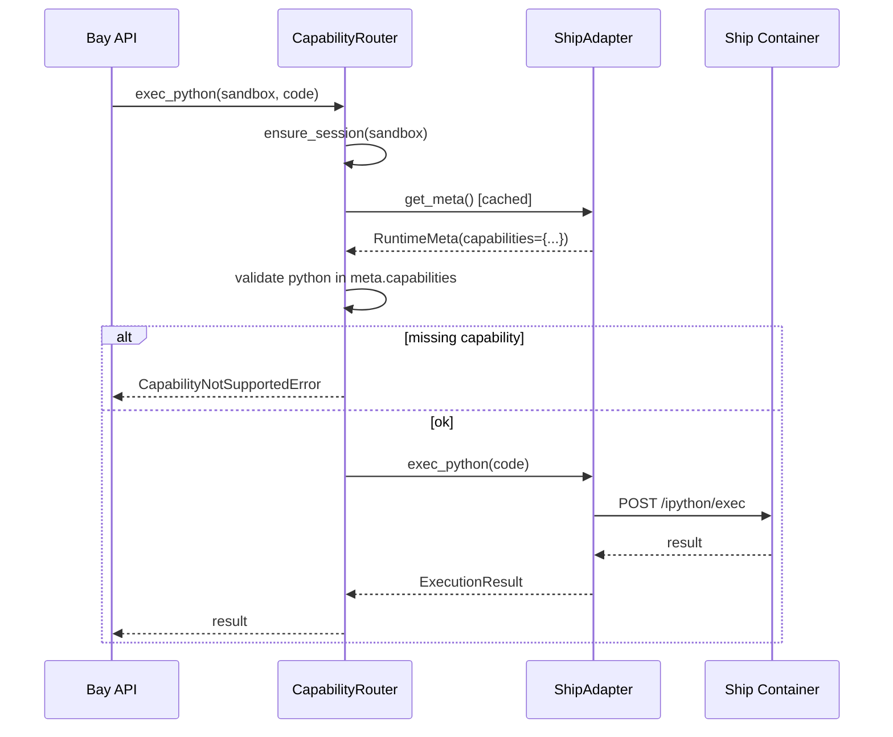

# 如何让 Bay 真正使用 Ship `/meta`

> 日期：2026-01-29
>
> 状态：Draft
>
> 问题：Ship 返回了丰富的 `/meta` 信息，但 Bay 目前只用于日志和缓存，没有实际驱动任何逻辑。

## 0. 现状

- `ShipAdapter.get_meta()` 拿到 `RuntimeMeta`：`name/version/api_version/mount_path/capabilities`
- 缓存后，只在日志中出现；`capabilities` 拿到了，但能力路由时并不校验，也不读取 endpoint 映射。

## 1. 能力校验（首选，最直接价值）

设计文档中已有 `_validate_capabilities()` 的占位草案（见 [`capability-adapter-design.md`](capability-adapter-design.md) 5.2），但目前未实现。

### 1.1 目标

在 `CapabilityRouter` 调用具体能力前，校验运行时是否声明支持该能力。若 profile 配置了 `python` 但 `/meta` 里没有该 key，则提前 reject，返回明确错误。

### 1.2 方案



### 1.3 实现要点

- `CapabilityRouter` 增加 `_require_capability(adapter, cap_name)` 方法。
- 在 `exec_python`/`exec_shell` 等方法开头调用。
- 引入 `CapabilityNotSupportedError`（可复用 `BayError`）。

### 1.4 好处

1. **Fail-fast**：调用不存在的能力时，不用等到 Ship 返回 404，直接从 meta 判断。
2. **解耦**：未来若 Browser 镜像不支持 python，Bay 可以统一处理。
3. **文档友好**：错误信息可列出 runtime 支持的能力列表，方便调试。

---

## 2. 动态 endpoint 映射（高级可选）

`/meta` 的 `capabilities.filesystem.endpoints` 给出了每个操作对应的 path，例如：

```json
{
  "filesystem": {
    "endpoints": {
      "create": "/fs/create_file",
      "read": "/fs/read_file"
    }
  }
}
```

目前 `ShipAdapter` 把这些 endpoint **写死**在代码里。如果想支持更灵活的协议演进，可以：

### 2.1 方案：Endpoint Discovery

1. `get_meta()` 后，在 adapter 内部缓存一个 `_endpoint_map: dict[str, str]`。
2. 各能力方法通过 key 查表决定真正调用的路径。

```python
# 伪代码
async def read_file(self, path: str) -> str:
    endpoint = self._endpoint_map.get("filesystem.read", "/fs/read_file")
    ...
```

### 2.2 适用场景

- 多版本协议共存（如 Ship v1 用 `/fs/*`，v2 用 `/storage/*`）。
- 第三方 runtime 实现不同 path 规则。

### 2.3 风险

- 增加复杂度；当前只有一个 Ship 镜像，收益有限。
- 如果 endpoint 格式差异大（RESTful vs 非 RESTful），仅靠 path 替换不够。

**建议**：先不实现，作为未来扩展点保留。

---

## 3. 版本/兼容性校验

`/meta` 返回 `api_version`，目前 Bay 不检查。可以：

- 在 `get_meta()` 后，断言 `api_version` 在支持范围内（例如 `v1`）。
- 若不兼容，抛 `RuntimeVersionError`，阻止 session 启动。

### 3.1 实现位置

在 `ShipAdapter.get_meta()` 末尾或 `CapabilityRouter` 首次获取 meta 时。

```python
SUPPORTED_API_VERSIONS = {"v1"}

meta = await adapter.get_meta()
if meta.api_version not in SUPPORTED_API_VERSIONS:
    raise RuntimeVersionError(f"Unsupported api_version: {meta.api_version}")
```

### 3.2 好处

- 避免 Bay 和 Ship 版本不匹配时出现奇怪的 500 错误。
- 为未来 Ship v2 提供平滑升级路径。

---

## 4. mount_path 动态读取（风险可控改动）

当前 Bay 自己写死 `/workspace`，而 Ship `/meta` 也返回 `workspace.mount_path`。

可以改为：

- 从 `/meta` 拿到 mount_path 后，在需要拼接路径的地方使用（如果有）。
- 目前 Bay 所有路径都是"相对于 /workspace"传给 Ship，Ship 内部再拼；所以 Bay 基本不需要知道绝对路径。

**结论**：此项改动价值不大，保持写死即可。

---

## 5. 建议实施路径

| 优先级 | 方案 | 工作量 | 收益 |
|:--|:--|:--|:--|
| P0 | 能力校验 | 小（20-30 行代码） | 高（Fail-fast + 错误友好） |
| P1 | 版本校验 | 小（10 行代码） | 中（兼容性保护） |
| P2 | 动态 endpoint | 中（需重构 adapter） | 低（当前无多版本） |
| - | mount_path 动态 | 极小 | 极低（无实际需求） |

### 5.1 建议下一步

1. 实现 **能力校验**：在 `CapabilityRouter` 加 `_require_capability()`，在各能力方法开头调用。
2. 可选：顺便加 **版本校验**。

---

## 6. 代码草案：能力校验

```python
# pkgs/bay/app/router/capability/capability.py

from app.errors import CapabilityNotSupportedError

class CapabilityRouter:
    ...

    async def _require_capability(
        self,
        adapter: BaseAdapter,
        capability: str,
    ) -> None:
        """确保 runtime 支持指定能力。"""
        meta = await adapter.get_meta()
        if capability not in meta.capabilities:
            raise CapabilityNotSupportedError(
                message=f"Runtime does not support capability: {capability}",
                capability=capability,
                available=list(meta.capabilities.keys()),
            )

    async def exec_python(
        self,
        sandbox: Sandbox,
        code: str,
        *,
        timeout: int = 30,
    ) -> ExecutionResult:
        session = await self.ensure_session(sandbox)
        adapter = self._get_adapter(session)
        await self._require_capability(adapter, "python")  # 新增
        ...
```

---

## 7. 是否需要新增错误类型

需要在 `app/errors.py` 添加：

```python
class CapabilityNotSupportedError(BayError):
    """运行时不支持请求的能力。"""

    def __init__(
        self,
        message: str,
        capability: str,
        available: list[str],
    ) -> None:
        super().__init__(message, status_code=400)
        self.capability = capability
        self.available = available

    def to_dict(self, request_id: str | None = None) -> dict:
        d = super().to_dict(request_id)
        d["capability"] = self.capability
        d["available_capabilities"] = self.available
        return d
```

---

## 附：完整 `/meta` 返回结构（参考）

```json
{
  "runtime": {
    "name": "ship",
    "version": "0.1.0",
    "api_version": "v1",
    "build": {
      "image": "ship:latest",
      "image_digest": null,
      "git_sha": null
    }
  },
  "workspace": {
    "mount_path": "/workspace"
  },
  "capabilities": {
    "filesystem": {
      "operations": ["create", "read", "write", "edit", "delete", "list", "upload", "download"],
      "path_mode": "relative_to_mount",
      "endpoints": {
        "create": "/fs/create_file",
        "read": "/fs/read_file",
        ...
      }
    },
    "shell": {
      "operations": ["exec", "processes"],
      "endpoints": { "exec": "/shell/exec", "processes": "/shell/processes" }
    },
    "python": {
      "operations": ["exec"],
      "engine": "ipython",
      "endpoints": { "exec": "/ipython/exec" }
    },
    "terminal": {
      "operations": ["ws"],
      "protocol": "websocket",
      "endpoints": { "ws": "/term/ws" }
    }
  }
}
```
