# Filesystem Capability 统一重构计划

> 目标：将 upload/download 合并进 filesystem capability，统一路由语义，使用 RESTful 风格

## 1. 问题分析

### 1.1 当前不一致点

| 层级 | 当前状态 | 问题 |
|:--|:--|:--|
| [`config.yaml`](../../pkgs/bay/config.yaml:38) | `filesystem`, `upload`, `download` 分离 | upload/download 逻辑上属于 filesystem |
| Bay 路由 | 全用 POST，路径 `/files/*` | 不够 RESTful |
| Ship 路由 | `/fs/*` + `/upload` + `/download` 分离 | 前缀不统一 |
| Ship `/meta` | filesystem 和 upload 分开声明 | 语义割裂 |

### 1.2 现状对比

```
Bay API (capabilities.py)          Ship API
--------------------------         --------------------------
POST /files/read                   POST /fs/read_file
POST /files/write                  POST /fs/write_file
POST /files/list                   POST /fs/list_dir
POST /files/delete                 POST /fs/delete_file
POST /files/upload                 POST /upload          ← 路径不一致
GET  /files/download               GET  /download        ← 路径不一致
```

## 2. 目标设计

### 2.1 Filesystem 6 原语规范

| 原语 | 语义 | HTTP 方法建议 |
|:--|:--|:--|
| `read` | 读取文件内容（文本） | GET |
| `write` | 写入/覆盖文件（文本） | PUT |
| `list` | 列出目录内容 | GET |
| `delete` | 删除文件或目录 | DELETE |
| `upload` | 上传二进制文件 | POST (multipart) |
| `download` | 下载文件（二进制流） | GET |

### 2.2 Bay RESTful 路由设计（推荐）

```
# 文件操作 - 使用 RESTful 语义
GET    /v1/sandboxes/{id}/filesystem/files?path=...      # read
PUT    /v1/sandboxes/{id}/filesystem/files               # write (body: {path, content})
DELETE /v1/sandboxes/{id}/filesystem/files?path=...      # delete

# 目录操作
GET    /v1/sandboxes/{id}/filesystem/directories?path=.  # list

# 二进制传输
POST   /v1/sandboxes/{id}/filesystem/upload              # upload (multipart)
GET    /v1/sandboxes/{id}/filesystem/download?path=...   # download
```

**备选方案（保持 POST，仅统一前缀）**：
```
POST   /v1/sandboxes/{id}/filesystem/read
POST   /v1/sandboxes/{id}/filesystem/write
POST   /v1/sandboxes/{id}/filesystem/list
POST   /v1/sandboxes/{id}/filesystem/delete
POST   /v1/sandboxes/{id}/filesystem/upload
GET    /v1/sandboxes/{id}/filesystem/download
```

### 2.3 Ship 路由统一设计

统一使用 `/fs` 前缀，将 upload/download 移入：

```
# 现有（保留）
POST /fs/read_file
POST /fs/write_file
POST /fs/list_dir
POST /fs/delete_file

# 移入（原 upload.py）
POST /fs/upload              ← 从 /upload 移动
GET  /fs/download            ← 从 /download 移动
```

### 2.4 config.yaml 更新

```yaml
profiles:
  - id: python-default
    capabilities:
      - filesystem    # 包含 read/write/list/delete/upload/download
      - shell
      - python
    # 移除: upload, download
```

### 2.5 Ship /meta 响应更新

```json
{
  "capabilities": {
    "filesystem": {
      "operations": ["read", "write", "list", "delete", "upload", "download"],
      "path_mode": "relative_to_mount",
      "endpoints": {
        "read": "/fs/read_file",
        "write": "/fs/write_file",
        "list": "/fs/list_dir",
        "delete": "/fs/delete_file",
        "upload": "/fs/upload",
        "download": "/fs/download"
      }
    }
  }
}
```

## 3. 实施步骤

### Phase A: Ship 端重构

| # | 任务 | 文件 |
|:--|:--|:--|
| A1 | 将 upload/download 端点移入 `filesystem.py` 或保留文件但改路由前缀 | [`pkgs/ship/app/components/upload.py`](../../pkgs/ship/app/components/upload.py:1) |
| A2 | 更新 `main.py` 路由注册 | [`pkgs/ship/app/main.py`](../../pkgs/ship/app/main.py:46) |
| A3 | 更新 `/meta` 响应结构 | [`pkgs/ship/app/main.py`](../../pkgs/ship/app/main.py:73) |
| A4 | 更新 Ship 单元测试 | `pkgs/ship/tests/` |

### Phase B: Bay 端重构

| # | 任务 | 文件 |
|:--|:--|:--|
| B1 | ShipAdapter 更新端点路径 | [`pkgs/bay/app/adapters/ship.py`](../../pkgs/bay/app/adapters/ship.py:227) |
| B2 | BaseAdapter 合并 upload/download 到 filesystem 注释 | [`pkgs/bay/app/adapters/base.py`](../../pkgs/bay/app/adapters/base.py:103) |
| B3 | capabilities.py 路由重构为 RESTful | [`pkgs/bay/app/api/v1/capabilities.py`](../../pkgs/bay/app/api/v1/capabilities.py:1) |
| B4 | CapabilityRouter 方法签名不变，仅更新日志标签 | [`pkgs/bay/app/router/capability/capability.py`](../../pkgs/bay/app/router/capability/capability.py:1) |
| B5 | 更新 config.yaml.example | `pkgs/bay/config.yaml.example` |
| B6 | 更新单元测试 | `pkgs/bay/tests/unit/test_ship_adapter.py` |
| B7 | 更新 E2E 测试 | `pkgs/bay/tests/integration/test_e2e_api.py` |

### Phase C: 文档更新

| # | 任务 | 文件 |
|:--|:--|:--|
| C1 | 更新 phase-1.md 接口清单 | [`plans/phase-1/phase-1.md`](phase-1.md:107) |
| C2 | 更新 bay-api.md | [`plans/bay-api.md`](../bay-api.md:1) |

## 4. 破坏性变更评估

| 影响范围 | 变更内容 | 兼容性 |
|:--|:--|:--|
| Bay 对外 API | `/files/*` → `/filesystem/*` | **破坏性** |
| Ship 内部 API | `/upload` → `/fs/upload` | 仅 Bay 调用，安全 |
| config.yaml | 移除 `upload`, `download` | 配置变更 |

**建议**：如果有外部用户，可考虑：
1. 先添加新路由，保留旧路由兼容
2. 在 v2 API 中移除旧路由

## 5. 决策点

请确认以下选项：

### Q1: Bay 路由风格选择

- [x] **A. 纯 RESTful**（推荐）：`GET/PUT/DELETE /filesystem/files`
- [ ] **B. POST 为主**：`POST /filesystem/read` 等
- [ ] **C. 混合**：read/list 用 GET，write 用 PUT，delete 用 DELETE

### Q2: 路径命名

- [x] **A. `/filesystem/`** - 语义明确
- [ ] **B. `/fs/`** - 简短
- [ ] **C. `/files/`** - 保持现状前缀

### Q3: 是否保留向后兼容

- [x] **A. 直接替换**（Phase 1 还未发布，可以直接改）
- [ ] **B. 双路由兼容一段时间**

## 6. Mermaid: 重构前后对比

```mermaid
flowchart LR
    subgraph Before[当前状态]
        direction TB
        BC[Bay config.yaml]
        BC --> F1[filesystem]
        BC --> U1[upload]
        BC --> D1[download]
        
        BR[Bay Routes /files/]
        BR --> R1[POST read]
        BR --> W1[POST write]
        BR --> L1[POST list]
        BR --> Del1[POST delete]
        BR --> Up1[POST upload]
        BR --> Dn1[GET download]
    end
    
    subgraph After[重构后]
        direction TB
        AC[Bay config.yaml]
        AC --> F2[filesystem - 含 6 原语]
        
        AR[Bay Routes /filesystem/]
        AR --> R2[GET files - read]
        AR --> W2[PUT files - write]
        AR --> L2[GET directories - list]
        AR --> Del2[DELETE files - delete]
        AR --> Up2[POST upload]
        AR --> Dn2[GET download]
    end
    
    Before --> After
```



---

**待确认后，切换到 Code 模式开始实施。**
