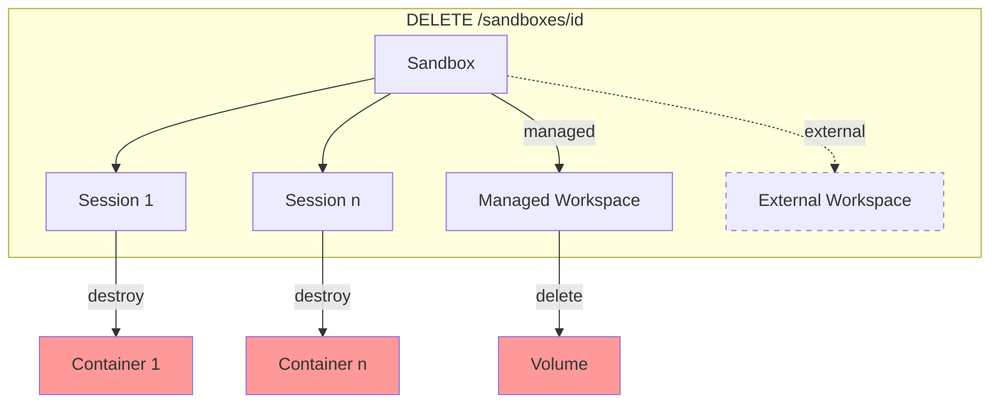

# Bay 后台 GC 机制设计

> 讨论 Bay 的资源回收/清理机制设计。

## 0. 资源生命周期概念梳理

### 0.1 资源模型总览

```
┌─────────────────────────────────────────────────────────────────────┐
│                           Sandbox                                   │
│  (对外稳定句柄)                                                       │
│                                                                     │
│  ┌─────────────────┐    ┌─────────────────┐    ┌─────────────────┐ │
│  │    Workspace    │    │     Profile     │    │    Session      │ │
│  │  (数据持久化)    │    │   (运行时规格)   │    │  (计算实例)      │ │
│  │                 │    │                 │    │   1:1 容器      │ │
│  │  - Docker Volume│    │  - 镜像/资源    │    │   可回收重建    │ │
│  │  - managed/     │    │  - capabilities │    │                 │ │
│  │    external     │    │  - idle_timeout │    │                 │ │
│  └─────────────────┘    └─────────────────┘    └─────────────────┘ │
└─────────────────────────────────────────────────────────────────────┘
```

### 0.2 各资源的 TTL / 过期概念

| 资源 | TTL 概念 | 配置来源 | 可延长? | 过期后行为 |
|------|----------|----------|---------|------------|
| **Sandbox** | `expires_at` (硬 TTL) | 创建时 `ttl` 参数 | **否** | 状态变为 `expired`，不可恢复 |
| **Sandbox** | `idle_expires_at` | profile.idle_timeout | **是** (keepalive) | Session 被回收，Sandbox 仍存在 |
| **Session** | 无独立 TTL | 跟随 Sandbox | N/A | 被 stop/回收 |
| **Workspace** | 无 TTL | 跟随 Sandbox (managed) 或永久 (external) | N/A | N/A |
| **Idempotency Key** | `expires_at` | config.ttl_hours | **否** | 被清理 |

### 0.3 详细说明

#### Sandbox TTL (`expires_at`)
- **含义**: Sandbox 的硬性生命周期上限
- **设置方式**: 创建时 `POST /v1/sandboxes {ttl: 3600}` (秒)
- **null/0**: 表示永不过期（需要配额策略兜底）
- **可延长**: ❌ 不可延长
- **过期后**:
  - `status` 变为 `expired`
  - `ensure_running` 不再自动恢复
  - 用户需显式删除或等待 GC 清理

#### Sandbox idle_timeout (`idle_expires_at`)
- **含义**: Session 空闲回收时间（软回收）
- **设置方式**: 来自 Profile 配置 (`profile.idle_timeout`)
- **可延长**: ✅ 通过 `POST /sandboxes/{id}/keepalive` 延长
- **超时后**:
  - 仅回收 Session（释放容器/算力）
  - Sandbox 和 Workspace 保留
  - 下次调用能力时自动 `ensure_running` 重建 Session

#### Session
- **无独立 TTL**: Session 生命周期完全由 Sandbox 控制
- **回收方式**:
  1. idle_timeout 到期 → 自动回收
  2. `POST /sandboxes/{id}/stop` → 显式回收
  3. Sandbox 过期/删除 → 级联回收
- **删除策略**: ⚠️ **当前是硬删除**（见 [`SessionManager.destroy()`](../../pkgs/bay/app/managers/session/session.py:261)）
  - 代码: `await self._db.delete(session)` 直接删除 DB 记录
  - 理由: Session 不对外暴露，无需审计追溯
  - 问题: 如果 `driver.destroy()` 失败，session 记录已删除但容器残留 → 需要孤儿容器 GC

#### Workspace
- **managed**: 生命周期绑定 Sandbox
  - Sandbox 删除时级联删除
- **external**: 独立生命周期
  - 需要显式 `DELETE /v1/workspaces/{id}`
  - 即使所有引用的 Sandbox 删除，workspace 仍保留

#### Idempotency Key
- **TTL**: config.idempotency.ttl_hours (默认 1 小时)
- **清理方式**:
  - 懒清理：check() 时顺带删除过期记录
  - 可选批量清理：cleanup_expired()

### 0.4 资源关系与级联删除



**级联规则:**
- `DELETE /sandboxes/{id}`:
  - 销毁所有关联 Session → 销毁容器
  - 若 Workspace 是 managed → 级联删除 Workspace → 删除 Volume
  - 若 Workspace 是 external → 不级联删除
- `POST /sandboxes/{id}/stop`:
  - 仅销毁 Session → 销毁容器
  - Sandbox 和 Workspace 保留

## 1. 背景与动机

### 1.1 需要 GC 清理的资源汇总

基于上述生命周期分析，以下是需要定时 GC 处理的场景：

```
┌─────────────────────────────────────────────────────────────────────────────┐
│                        需要 GC 清理的资源                                    │
├─────────────────────────────────────────────────────────────────────────────┤
│                                                                             │
│  ┌─────────────────────────────────────────────────────────────────────┐   │
│  │  1. 空闲 Session (idle_expires_at 过期)                              │   │
│  │     - 产生: 用户停止操作，超过 profile.idle_timeout                   │   │
│  │     - 清理: 停止容器，删除 session 记录                               │   │
│  │     - 触发: GC 或下次请求时懒触发                                     │   │
│  │     - 优先级: ★★★ 高（释放算力）                                     │   │
│  └─────────────────────────────────────────────────────────────────────┘   │
│                                                                             │
│  ┌─────────────────────────────────────────────────────────────────────┐   │
│  │  2. 过期 Sandbox (expires_at 过期)                                   │   │
│  │     - 产生: Sandbox TTL 到期                                         │   │
│  │     - 清理: 软删除 sandbox，级联清理 session + managed workspace      │   │
│  │     - 触发: GC 定时扫描                                              │   │
│  │     - 优先级: ★★☆ 中（释放存储和算力）                               │   │
│  └─────────────────────────────────────────────────────────────────────┘   │
│                                                                             │
│  ┌─────────────────────────────────────────────────────────────────────┐   │
│  │  3. 孤儿 Managed Workspace                                           │   │
│  │     - 产生: Sandbox 删除时级联删除 workspace 失败                     │   │
│  │     - 清理: 删除 volume，删除 workspace 记录                          │   │
│  │     - 触发: GC 定时扫描                                              │   │
│  │     - 优先级: ★★☆ 中（释放存储）                                     │   │
│  └─────────────────────────────────────────────────────────────────────┘   │
│                                                                             │
│  ┌─────────────────────────────────────────────────────────────────────┐   │
│  │  4. 孤儿容器 (Docker/K8s)                                            │   │
│  │     - 产生: Session stop/destroy 失败，或 Bay 重启后容器残留          │   │
│  │     - 清理: 强制停止并删除容器                                        │   │
│  │     - 触发: GC 定时扫描 + Bay 启动时 reconcile                       │   │
│  │     - 优先级: ★★★ 高（释放算力）                                     │   │
│  └─────────────────────────────────────────────────────────────────────┘   │
│                                                                             │
│  ┌─────────────────────────────────────────────────────────────────────┐   │
│  │  5. 过期 Idempotency Key                                             │   │
│  │     - 产生: 正常过期（config.ttl_hours）                              │   │
│  │     - 清理: 删除 DB 记录                                             │   │
│  │     - 触发: 懒清理 + GC 批量清理                                      │   │
│  │     - 优先级: ★☆☆ 低（仅 DB 空间）                                   │   │
│  └─────────────────────────────────────────────────────────────────────┘   │
│                                                                             │
│  ┌─────────────────────────────────────────────────────────────────────┐   │
│  │  6. 长期不活跃的 TTL=null Sandbox (可选)                             │   │
│  │     - 产生: 用户创建后长期未使用                                      │   │
│  │     - 清理: 发送警告 → 一定期限后软删除                               │   │
│  │     - 触发: GC 定时扫描                                              │   │
│  │     - 优先级: ★☆☆ 低（策略驱动，非必须）                             │   │
│  └─────────────────────────────────────────────────────────────────────┘   │
└─────────────────────────────────────────────────────────────────────────────┘
```

### 1.2 资源清理详细表格

| # | 资源类型 | 产生条件 | 清理条件 | 清理动作 | 后果（不清理） | 优先级 |
|---|----------|----------|----------|----------|----------------|--------|
| 1 | 空闲 Session | idle_timeout 到期 | `idle_expires_at < now` | stop 容器，删 session | 算力浪费 | 高 |
| 2 | 过期 Sandbox | TTL 到期 | `expires_at < now && deleted_at == null` | 软删除 + 级联清理 | 资源占用 | 中 |
| 3 | 孤儿 Workspace | 级联删除失败 | `managed && (sandbox.deleted_at != null)` | 删 volume + 删记录 | 存储泄露 | 中 |
| 4 | 孤儿容器 | stop 失败/Bay 重启 | 容器存在但无对应 session | 强制删容器 | 算力泄露 | 高 |
| 5 | 过期幂等键 | 正常过期 | `expires_at < now` | 删 DB 记录 | DB 膨胀 | 低 |
| 6 | 僵尸 Sandbox | TTL=null 且长期未用 | `last_active_at < now - N days` | 警告/软删除 | 资源占用 | 低 |

### 1.3 现有机制

根据代码扫描，Bay 目前：

| 组件 | 清理方式 | 备注 |
|------|----------|------|
| IdempotencyService | 懒清理 | check() 时删除过期记录 |
| Sandbox 过期 | 仅状态计算 | `is_expired` 属性，无主动清理 |
| Workspace | 级联删除 | sandbox 删除时同步级联 |
| Session/容器 | stop 时同步清理 | 无孤儿检测 |

**问题**: 
- 懒清理依赖请求触发，长期无请求时不会清理
- 级联删除失败会导致资源残留
- 无孤儿检测机制

## 2. GC 触发方式对比

| 方式 | 描述 | 优点 | 缺点 |
|------|------|------|------|
| **定时后台任务** | 每 N 分钟运行 | 自动化，可靠 | 增加复杂度 |
| **启动时清理** | Bay 启动时扫描 | 简单 | 长期运行时无效 |
| **请求时懒清理** | 每次请求顺带检查 | 无后台开销 | 影响延迟，依赖流量 |
| **Admin API** | 手动触发 | 可控 | 需要人工 |

**推荐**: 定时后台任务 + 启动时清理（确保重启后能清理残留）

## 3. 设计方案

### 3.1 抽象模型

```python
from abc import ABC, abstractmethod
from datetime import timedelta

class GCTask(ABC):
    """GC 任务抽象基类"""
    
    @property
    @abstractmethod
    def name(self) -> str:
        """任务名称，用于日志和监控"""
        ...
    
    @property
    @abstractmethod
    def interval(self) -> timedelta:
        """执行间隔"""
        ...
    
    @abstractmethod
    async def run(self) -> GCResult:
        """
        执行清理任务
        
        Returns:
            GCResult: 包含清理数量和错误信息
        """
        ...


@dataclass
class GCResult:
    """GC 执行结果"""
    task_name: str
    cleaned: int = 0
    errors: int = 0
    duration_ms: float = 0
```

### 3.2 GC 调度器

```python
class GCScheduler:
    """GC 调度器 - 管理多个 GC 任务的生命周期"""
    
    def __init__(self, tasks: list[GCTask]):
        self._tasks = tasks
        self._running = False
        self._task_handles: list[asyncio.Task] = []
    
    async def start(self):
        """启动所有 GC 任务"""
        self._running = True
        logger.info("gc.scheduler.start", task_count=len(self._tasks))
        
        for task in self._tasks:
            handle = asyncio.create_task(
                self._run_loop(task),
                name=f"gc-{task.name}"
            )
            self._task_handles.append(handle)
    
    async def stop(self):
        """停止所有 GC 任务"""
        self._running = False
        for handle in self._task_handles:
            handle.cancel()
        await asyncio.gather(*self._task_handles, return_exceptions=True)
        logger.info("gc.scheduler.stop")
    
    async def _run_loop(self, task: GCTask):
        """单个任务的运行循环"""
        while self._running:
            try:
                result = await task.run()
                if result.cleaned > 0 or result.errors > 0:
                    logger.info(
                        f"gc.{task.name}.done",
                        cleaned=result.cleaned,
                        errors=result.errors,
                        duration_ms=result.duration_ms,
                    )
            except Exception as e:
                logger.error(f"gc.{task.name}.error", error=str(e))
            
            await asyncio.sleep(task.interval.total_seconds())
    
    async def run_once(self, task_name: str | None = None) -> list[GCResult]:
        """立即执行一次（用于 Admin API 或测试）"""
        results = []
        for task in self._tasks:
            if task_name is None or task.name == task_name:
                result = await task.run()
                results.append(result)
        return results
```

### 3.3 具体 GC 任务实现

#### 3.3.1 OrphanWorkspaceGC

```python
class OrphanWorkspaceGC(GCTask):
    """清理孤儿 managed workspace"""
    
    def __init__(self, driver: Driver, db_session_factory):
        self._driver = driver
        self._session_factory = db_session_factory
    
    @property
    def name(self) -> str:
        return "orphan_workspace"
    
    @property
    def interval(self) -> timedelta:
        return timedelta(minutes=5)
    
    async def run(self) -> GCResult:
        start = time.monotonic()
        cleaned = 0
        errors = 0
        
        async with self._session_factory() as db:
            # 查询: managed=True AND (
            #   managed_by_sandbox_id IS NULL OR
            #   sandbox.deleted_at IS NOT NULL
            # )
            orphans = await db.execute(
                select(Workspace)
                .outerjoin(Sandbox, Workspace.managed_by_sandbox_id == Sandbox.id)
                .where(Workspace.managed == True)
                .where(
                    or_(
                        Workspace.managed_by_sandbox_id.is_(None),
                        Sandbox.deleted_at.isnot(None),
                    )
                )
            )
            
            for ws in orphans.scalars():
                try:
                    await self._driver.delete_volume(ws.driver_ref)
                    await db.delete(ws)
                    cleaned += 1
                except Exception as e:
                    logger.warning("gc.orphan_workspace.item_failed", 
                                   workspace_id=ws.id, error=str(e))
                    errors += 1
            
            await db.commit()
        
        return GCResult(
            task_name=self.name,
            cleaned=cleaned,
            errors=errors,
            duration_ms=(time.monotonic() - start) * 1000,
        )
```

#### 3.3.2 ExpiredIdempotencyKeyGC

```python
class ExpiredIdempotencyKeyGC(GCTask):
    """清理过期的幂等键"""
    
    @property
    def name(self) -> str:
        return "expired_idempotency_key"
    
    @property
    def interval(self) -> timedelta:
        return timedelta(hours=1)
    
    async def run(self) -> GCResult:
        # 复用现有的 IdempotencyService.cleanup_expired()
        cleaned = await self._idempotency_service.cleanup_expired()
        return GCResult(task_name=self.name, cleaned=cleaned)
```

#### 3.3.3 ExpiredSandboxGC（Phase 2）

```python
class ExpiredSandboxGC(GCTask):
    """清理过期的 sandbox"""
    
    @property
    def name(self) -> str:
        return "expired_sandbox"
    
    @property
    def interval(self) -> timedelta:
        return timedelta(minutes=10)
    
    async def run(self) -> GCResult:
        # 查询 expires_at < now AND deleted_at IS NULL
        # 对每个执行软删除 + 级联清理
        ...
```

### 3.4 集成到 main.py

```python
from app.services.gc import GCScheduler, OrphanWorkspaceGC, ExpiredIdempotencyKeyGC

@asynccontextmanager
async def lifespan(app: FastAPI):
    logger.info("bay.startup", version="0.1.0")
    await init_db()
    
    # 创建 GC 调度器
    driver = get_driver()
    gc_scheduler = GCScheduler([
        OrphanWorkspaceGC(driver=driver, db_session_factory=get_session_factory),
        ExpiredIdempotencyKeyGC(db_session_factory=get_session_factory),
    ])
    
    # 启动时先执行一次清理
    await gc_scheduler.run_once()
    
    # 启动后台调度
    await gc_scheduler.start()
    
    # 保存到 app.state 供 Admin API 使用
    app.state.gc_scheduler = gc_scheduler
    
    yield
    
    # 关闭
    await gc_scheduler.stop()
    await close_db()
```

## 4. 配置

```yaml
# config.yaml
gc:
  enabled: true
  
  orphan_workspace:
    enabled: true
    interval_minutes: 5
    
  expired_idempotency_key:
    enabled: true
    interval_hours: 1
    
  expired_sandbox:
    enabled: false  # Phase 2
    interval_minutes: 10
```

## 5. Admin API（可选）

```
POST /admin/gc
POST /admin/gc/{task_name}
GET /admin/gc/status
```

## 6. 监控与告警

- **指标**: gc_cleaned_total{task="xxx"}, gc_errors_total{task="xxx"}, gc_duration_seconds{task="xxx"}
- **告警**: gc_errors_total 持续增长时告警

## 7. Phase 划分

| Phase | 内容 |
|-------|------|
| Phase 1 | OrphanWorkspaceGC（简化版，无抽象类） |
| Phase 1.5 | 抽象 GCTask + GCScheduler，重构 OrphanWorkspaceGC |
| Phase 2 | ExpiredIdempotencyKeyGC, ExpiredSandboxGC, Admin API |

## 8. Sandbox 设计理念与使用场景

### 8.1 Sandbox 是什么？

**Sandbox 是对外暴露的唯一稳定句柄**，它聚合了：
- Workspace（数据）
- Profile（规格）
- Session（算力）

**核心设计思想**：隔离"用户持有的引用"与"后端易变的实现细节"

```
用户视角                      Bay 内部
---------                    ---------
sandbox_id  ─────────────►  Sandbox
  (稳定)                       │
                               ├──► Workspace (Volume)
                               ├──► Profile (Config)
                               └──► Session (Container)
                                      ↑
                                   可回收重建
```

### 8.2 典型使用场景

#### 场景 A：LLM Agent 代码执行
```
1. Agent 创建 Sandbox（TTL=1小时）
2. 多轮对话中反复调用 /python/exec
3. 空闲 30 分钟后 Session 被回收（省钱）
4. 用户继续对话 → ensure_running 自动重建 Session
5. 1 小时后 Sandbox 过期，任务结束
```

#### 场景 B：长期开发环境
```
1. 用户创建 Sandbox（TTL=null，永不过期）
2. 关联一个 external workspace（代码仓库）
3. 每天使用几小时，其余时间 idle 回收
4. 用完主动删除，或由管理员定期清理
```

#### 场景 C：批量任务
```
1. 创建多个 Sandbox（TTL=10分钟）
2. 并行执行任务
3. 任务完成后 Sandbox 自动过期
4. GC 批量清理过期资源
```

#### 场景 D：稳定的持久化上下文 + 按需启动（重点讨论）

**用户需求**：
- 拥有一个稳定的"开发环境"，数据持久化
- 不希望 24/7 有容器运行（省成本）
- 需要时自动启动，空闲时自动回收

**当前设计下的实现方式**：

**方式 1：使用 TTL=null 的 Sandbox**
```
1. POST /v1/sandboxes {ttl: null, profile: "python-default"}
   → sandbox-dev-001, status=idle (无 Session)
2. 用户调用 POST /sandboxes/sandbox-dev-001/python/exec
   → ensure_running 自动启动 Session
   → 执行代码
3. 空闲 30 分钟后 Session 被回收
   → sandbox status 变为 idle
4. 用户再次调用 → 自动重建 Session
5. 重复上述过程，直到用户主动删除
```

**优点**：
- 完全符合当前设计
- 用户持有稳定的 sandbox_id
- 数据持久化在 managed workspace 中
- 容器按需启动/回收

**注意**：
- TTL=null 需要配额策略兜底（限制每用户 sandbox 数量）
- 需要定期清理长期不活跃的 sandbox（可选）

**方式 2：Workspace 为主，Sandbox 临时创建**
```
1. POST /v1/workspaces → ws-persistent（external）
2. 需要时：POST /v1/sandboxes {workspace_id: ws-persistent, ttl: 3600}
   → sandbox-temp-001
3. 使用完毕或过期：DELETE sandbox 或自动过期
4. 下次需要：创建新 sandbox 挂载同一 workspace
```

**优点**：
- 更清晰的资源边界
- Sandbox 严格是临时的

**缺点**：
- 每次都要创建新 sandbox_id
- 上层需要管理 workspace_id → sandbox_id 的映射

---

**比较两种方式**：

| 方面 | 方式 1 (TTL=null Sandbox) | 方式 2 (External Workspace) |
|------|---------------------------|----------------------------|
| ID 稳定性 | sandbox_id 稳定 | workspace_id 稳定，sandbox_id 变化 |
| 资源占用 | Sandbox DB 记录常驻 | 只有 workspace 常驻 |
| 使用复杂度 | 简单 | 需要管理两层 ID |
| 计费模型 | 按 sandbox 存活时间? | 按 workspace 存储 + sandbox 运行时间 |
| 配额管理 | 需要限制 TTL=null sandbox 数量 | 自然限制（sandbox 会过期） |

**建议**：两种方式都支持，让用户根据场景选择
- 个人开发者：方式 1
- SaaS 平台/多租户：方式 2

### 8.3 TTL 延长 API 设计（已拍板）

**决策**：支持 Sandbox TTL 延长，且：
- ✅ 支持 `Idempotency-Key`
- ✅ 不允许复活已过期的 sandbox
- ✅ 不允许延长到永不过期（不允许把有期限改成 `ttl=null`）
- ✅ 永不过期的 sandbox（`expires_at is null`）延长无意义 → 直接拒绝

#### 8.3.1 端点定义

- `POST /v1/sandboxes/{id}/extend_ttl`
- Header：`Idempotency-Key: <opaque-string>`（可选，但建议客户端在重试时总是传）
- Body：

```json
{
  "extend_by": 600
}
```

- Response：`200`，返回更新后的 Sandbox（同 [`get_sandbox()`](../../pkgs/bay/app/api/v1/sandboxes.py:160) 的 `SandboxResponse`，便于客户端同步 `expires_at/status`，且可被 `Idempotency-Key` 回放）

#### 8.3.2 expires_at 计算规则

设：
- `now = datetime.utcnow()`（由服务端在请求处理时生成，客户端不提供）
- `old = sandbox.expires_at`（只从 DB 读取，客户端不可伪造）

规则：
1. 若 `old is null`（永不过期）→ `409 Conflict`
2. 若 `old < now`（已过期）→ `409 Conflict`
3. 否则：

```
new = max(old, now) + extend_by
```

> `max(old, now)` 是防御性写法：避免因为时钟漂移/处理延迟导致误判。

#### 8.3.2.1 并发语义（Phase 1 选择）

- ✅ 支持 `Idempotency-Key` 用于“同一请求重试”的幂等
- ⚠️ **不保证不同 Idempotency-Key 的并发延长可叠加**（可能发生丢失更新）
- 该风险 Phase 1 暂接受；如需严格叠加，可在 Phase 2 引入：
  - DB 原子 update
  - sandbox 粒度串行化锁
  - 或服务端 CAS 重试

#### 8.3.3 参数约束（建议）

- `extend_by` 必须为正整数
- 建议增加上限：例如 `extend_by <= 86400`（单次最多延长 24h）
- 建议增加总上限（二选一）：
  - `max_ttl_seconds`（从创建时算起的总 TTL 上限）
  - `max_expires_at`（绝对到期上限）

#### 8.3.4 幂等语义

- 幂等键 scope：`owner + Idempotency-Key + path + method + body_fingerprint`
- 重复请求（相同 fingerprint）返回同一结果
- 冲突请求（同 key 不同 fingerprint）返回 `409 Conflict`

可直接复用 [`IdempotencyService`](../../pkgs/bay/app/services/idempotency.py:1) 的机制。

#### 8.3.5 错误码约定（已拍板）

对齐统一错误模型（见 [`plans/bay-api.md`](../bay-api.md:80)），`extend_ttl` 相关错误码采用“更细的稳定 `error.code`”策略：

- `409` + `error.code = sandbox_expired`
  - 条件：`old < now`
  - 含义：sandbox 已过期，不允许延长（不可复活）
- `409` + `error.code = sandbox_ttl_infinite`
  - 条件：`old is null`
  - 含义：sandbox 为永不过期，延长无意义，拒绝
- `409` + `error.code = conflict`
  - 条件：`Idempotency-Key` 冲突（同 key 不同 fingerprint）

建议 details 字段最小化且可调试：

```json
{
  "error": {
    "code": "sandbox_expired",
    "message": "sandbox is expired, cannot extend ttl",
    "request_id": "...",
    "details": {
      "sandbox_id": "sandbox-abc123",
      "expires_at": "2026-01-30T08:00:00Z",
      "now": "2026-01-30T08:00:01Z"
    }
  }
}
```

> 注：`expires_at`/`now` 是否回传可以做配置开关；Phase 1 可先回传 `sandbox_id` + `expires_at`。

### 8.4 TTL 延长的使用场景分析（对齐本决策）

| 场景 | 是否用 extend_ttl | 说明 |
|------|------------------|------|
| LLM Agent 任务超预期 | ✅ | 未过期时可延长 |
| 用户误设太短 TTL | ✅ | 未过期时可补救 |
| 长期开发环境 | ❌ | 直接创建 `ttl=null` |
| 批量任务 | 可选 | 尽量落在 TTL 内；必要时可延长 |

---

## 9. 已敲定的决策

### 9.1 ✅ 长期不活跃的 TTL=null Sandbox 不主动清理

**决策**: 不做自动清理，由用户主动删除

**理由**:
1. 用户付费使用，有权保留
2. 避免误删重要数据
3. 配额限制（每用户 sandbox 数量上限）足以控制资源泄露

**替代措施**:
- 配额限制：限制每用户 TTL=null sandbox 数量
- 可选告警：`last_active_at > N days` 时发邮件提醒
- Admin API：管理员可手动批量清理

### 9.2 ✅ Session 记录保持硬删除

**决策**: Session 记录继续使用硬删除，不改为软删除

**理由**:
1. Session 不对外暴露，无 ID 引用需要保持
2. 减少 DB 膨胀
3. 孤儿容器问题通过 GC 解决，不依赖 session 记录

**孤儿容器检测方式**:
```python
# 基于容器 labels 检测，不依赖 DB
orphan_containers = await driver.list_containers(
    labels={"bay.sandbox_id": "*"}  # 所有 bay 管理的容器
)
for container in orphan_containers:
    session_id = container.labels.get("bay.session_id")
    session = await db.get(Session, session_id)
    if session is None:
        # session 记录不存在 → 孤儿容器
        await driver.destroy(container.id)
```

---

## 10. 待讨论

1. **GC 间隔配置**: 默认值是否合适？
2. **错误处理**: 单个资源清理失败是否应该继续处理其他资源？
3. **批量 vs 逐条**: 大量资源时是否需要分批处理？
4. **锁与并发**: 多实例部署时如何避免重复清理？
5. **Sandbox TTL 延长**: 是否需要支持？如果需要，用什么 API？

## 11. Phase 1 GC 范围总结

基于讨论，Phase 1 需要实现的 GC 任务：

| # | GC 任务 | 优先级 | Phase 1 范围 |
|---|---------|--------|--------------|
| 1 | IdleSessionGC | 高 | ✅ 需要 |
| 2 | ExpiredSandboxGC | 中 | ✅ 需要 |
| 3 | OrphanWorkspaceGC | 中 | ✅ 需要 |
| 4 | OrphanContainerGC | 高 | ✅ 需要 (启动时 + 定时) |
| 5 | ExpiredIdempotencyKeyGC | 低 | ⚠️ 可选（已有懒清理） |
| 6 | InactiveSandboxGC | 低 | ❌ 不做 |
