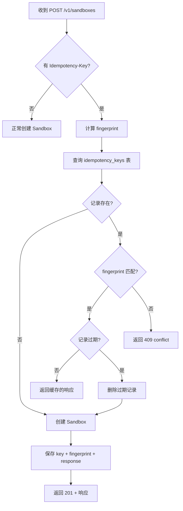

# Bay 幂等层设计

> 更新日期：2026-01-29
>
> 基于：[`bay-api.md`](../bay-api.md) 第 1.2 节、[`phase-1.md`](phase-1.md) 第 3.1.3 节
>
> **状态：✅ 设计已敲定**

## 1. 背景与目标

### 1.1 问题场景

1. **网络超时重试**：客户端发送 `POST /v1/sandboxes`，服务端处理成功但响应丢失，客户端重试
2. **重复提交**：用户多次点击"创建"按钮
3. **分布式环境**：多实例 Bay 需要一致的幂等语义

### 1.2 目标

- `POST /v1/sandboxes` 支持 `Idempotency-Key` header
- 同一 `owner + key` 返回相同的结果（幂等）
- fingerprint 不同时返回 `409 conflict`

## 2. 设计要点（需敲定）

### 2.1 作用域

| 问题 | 选项 | 建议 |
|:--|:--|:--|
| 哪些端点支持？ | A) 仅 `POST /v1/sandboxes` <br> B) 所有 POST 端点 | **A) 仅 POST /v1/sandboxes**（Phase 1 最小范围） |
| `Idempotency-Key` 是否必须？ | A) 必须 <br> B) 可选 | **B) 可选**（无 key 时不做幂等检查） |

### 2.2 Key 规范

| 问题 | 选项 | 建议 |
|:--|:--|:--|
| Key 格式限制 | A) 任意字符串 <br> B) UUID 格式 <br> C) 限长 + 字符集 | **C) 限长 128 字符，允许 `[a-zA-Z0-9_-]`** |
| Key 命名空间 | A) 全局唯一 <br> B) 按 owner 隔离 | **B) 按 owner 隔离**（同一 owner 下唯一） |

### 2.3 Fingerprint 计算

| 问题 | 选项 | 建议 |
|:--|:--|:--|
| fingerprint 组成 | A) 仅 key <br> B) key + path + method <br> C) key + path + method + body_hash | **C) key + path + method + body_hash** |
| body hash 算法 | A) MD5 <br> B) SHA256 <br> C) blake3 | **B) SHA256**（安全性 + 标准化） |

### 2.4 存储与过期

| 问题 | 选项 | 建议 |
|:--|:--|:--|
| 存储位置 | A) 同一 SQLite DB <br> B) Redis <br> C) 内存 LRU | **A) 同一 SQLite DB**（Phase 1 无额外依赖） |
| TTL 时长 | A) 固定 24h <br> B) 可配置 <br> C) 跟随 Sandbox TTL | **B) 可配置，默认 24h** |
| 过期清理 | A) 后台定时任务 <br> B) 查询时惰性删除 <br> C) 两者结合 | **B) 查询时惰性删除**（Phase 1 简化） |

### 2.5 响应快照

| 问题 | 选项 | 建议 |
|:--|:--|:--|
| 快照内容 | A) 完整响应 body <br> B) 仅 sandbox_id <br> C) 响应 + status_code | **C) 响应 body + status_code** |
| 快照格式 | A) JSON 字符串 <br> B) 压缩二进制 | **A) JSON 字符串**（可读性 + 简单） |

### 2.6 并发处理

| 问题 | 选项 | 建议 |
|:--|:--|:--|
| 并发写入相同 key | A) 数据库唯一约束报错 <br> B) SELECT FOR UPDATE 锁 <br> C) 乐观锁 + 重试 | **A) 数据库唯一约束**（最简单，失败后重查） |

## 3. 流程设计



## 4. 数据模型

现有模型 [`IdempotencyKey`](../../pkgs/bay/app/models/idempotency.py:14) 基本满足需求：

```python
class IdempotencyKey(SQLModel, table=True):
    # 复合主键: owner + key
    owner: str = Field(primary_key=True)
    key: str = Field(primary_key=True)
    
    # 请求指纹
    request_fingerprint: str  # SHA256(path + method + body)
    
    # 缓存响应
    response_snapshot: str    # JSON 字符串
    status_code: int
    
    # TTL
    created_at: datetime
    expires_at: datetime
```

**需要修改**：
- 增加 `path` 和 `method` 字段？或直接放入 fingerprint 即可

## 5. API 层接入

### 5.1 中间件 vs 装饰器 vs 显式调用

| 方案 | 优点 | 缺点 |
|:--|:--|:--|
| 全局中间件 | 统一处理 | 难以区分哪些端点需要幂等 |
| 装饰器 | 声明式 | 需要解析请求体 |
| **显式调用** | 灵活、可控 | 需要在每个端点手动调用 |

**建议**：Phase 1 采用**显式调用**，后续可重构为装饰器。

### 5.2 伪代码

```python
@router.post("", response_model=SandboxResponse, status_code=201)
async def create_sandbox(
    request: CreateSandboxRequest,
    sandbox_mgr: SandboxManagerDep,
    owner: OwnerDep,
    idempotency_svc: IdempotencySvcDep,
    idempotency_key: str | None = Header(None, alias="Idempotency-Key"),
    raw_request: Request,  # 获取原始 body
) -> SandboxResponse:
    # 1. 幂等检查
    if idempotency_key:
        cached = await idempotency_svc.check(
            owner=owner,
            key=idempotency_key,
            path=raw_request.url.path,
            method="POST",
            body=await raw_request.body(),
        )
        if cached:
            return cached.response  # 返回缓存响应
    
    # 2. 正常创建
    sandbox = await sandbox_mgr.create(...)
    response = _sandbox_to_response(sandbox)
    
    # 3. 保存幂等记录
    if idempotency_key:
        await idempotency_svc.save(
            owner=owner,
            key=idempotency_key,
            path=raw_request.url.path,
            method="POST",
            body=await raw_request.body(),
            response=response,
            status_code=201,
        )
    
    return response
```

**问题**：`await raw_request.body()` 只能调用一次，需要在 FastAPI 中缓存。

### 5.3 解决 body 读取问题

方案 A：自定义中间件缓存 body
方案 B：使用 `request.state` 保存
方案 C：对于 Pydantic model，用 `request.model_dump_json()` 替代

**建议**：**方案 C**，直接对 Pydantic request model 序列化。

## 6. 实现步骤

| # | 任务 | 文件 |
|:--|:--|:--|
| 1 | 创建 `IdempotencyService` | `app/services/idempotency.py` |
| 2 | 添加配置项 | `app/config.py` |
| 3 | 注册依赖注入 | `app/api/dependencies.py` |
| 4 | 修改 `create_sandbox` | `app/api/v1/sandboxes.py` |
| 5 | 添加单元测试 | `tests/unit/test_idempotency.py` |
| 6 | 添加 E2E 测试 | `tests/integration/test_e2e_api.py` |

## 7. 已敲定决策

| # | 问题 | 决策 |
|:--|:--|:--|
| 1 | fingerprint 是否包含请求体？ | ✅ **包含**（更严格，同一 key 不同参数报 409） |
| 2 | 409 冲突时返回原响应？ | ✅ **仅返回错误**（更安全，客户端需用原 key 重查） |
| 3 | key 过期后再次使用同一 key？ | ✅ **允许**（视为新请求） |
| 4 | TTL 时长 | ✅ **可配置，默认 24h** |
| 5 | 实现方式 | ✅ **显式调用**（Phase 1 简单可控） |
| 6 | 存储位置 | ✅ **SQLite 同库** |
| 7 | 过期清理 | ✅ **查询时惰性删除** |

---

## 附录：现有相关代码位置

- Model：[`pkgs/bay/app/models/idempotency.py`](../../pkgs/bay/app/models/idempotency.py)
- API：[`pkgs/bay/app/api/v1/sandboxes.py`](../../pkgs/bay/app/api/v1/sandboxes.py:72)（`create_sandbox` 已预留 `idempotency_key` 参数）
- 错误：[`pkgs/bay/app/errors.py`](../../pkgs/bay/app/errors.py:110)（`ConflictError` 已定义）
