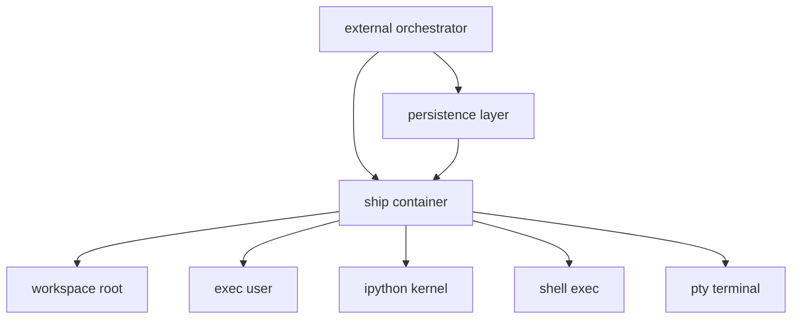

# pkgs/ship 暴露的原语盘点 + 单容器单会话可删项建议

> 目标：你把 `pkgs/ship` 当作运行时（runtime）来用，并且明确 **一个容器只服务一个会话**。在这个前提下，当前实现里“多会话”相关的抽象/状态管理，有不少可以直接删掉或降级为兼容壳。

## 1. Ship 当前对外暴露的原语（API surface）

入口应用：[`pkgs/ship/app/main.py`](pkgs/ship/app/main.py)

### 1.1 文件系统原语（/fs）
代码：[`pkgs/ship/app/components/filesystem.py`](pkgs/ship/app/components/filesystem.py)

- 创建文件：`POST /fs/create_file`
- 读取文件：`POST /fs/read_file`
- 写入文件：`POST /fs/write_file`
- 编辑文件（字符串替换）：`POST /fs/edit_file`
- 删除文件/目录：`POST /fs/delete_file`
- 列目录：`POST /fs/list_dir`

这些接口都依赖路径沙箱：[`resolve_path()`](pkgs/ship/app/workspace.py:49)，并且要求请求头 `X-SESSION-ID`。

### 1.2 上传/下载原语
代码：[`pkgs/ship/app/components/upload.py`](pkgs/ship/app/components/upload.py)

- 上传：`POST /upload`
- 下载：`GET /download`

同样走 [`resolve_path()`](pkgs/ship/app/workspace.py:49) + `X-SESSION-ID`。

### 1.3 Shell 执行原语（/shell）
代码：[`pkgs/ship/app/components/shell.py`](pkgs/ship/app/components/shell.py)

- 执行命令：`POST /shell/exec`
  - 支持 `cwd`、`env`、`timeout`、`shell`（bash -lc vs exec）、`background`（后台进程）
- 列后台进程：`GET /shell/processes`

核心实现依赖：[`run_as_user()`](pkgs/ship/app/components/user_manager.py:554)，它把“session -> linux user -> workspace”绑在一起。

### 1.4 交互式终端原语（/term）
代码：[`pkgs/ship/app/components/term.py`](pkgs/ship/app/components/term.py)

- `WS /term/ws?session_id=...&cols=...&rows=...`
  - PTY + xterm.js 风格
  - 支持 resize 控制消息

底层通过 [`UserManager.start_interactive_shell()`](pkgs/ship/app/components/user_manager.py:441) 启动 sudo 切用户的 login shell。

### 1.5 IPython/Jupyter kernel 原语（/ipython）
代码：[`pkgs/ship/app/components/ipython.py`](pkgs/ship/app/components/ipython.py)

- 执行代码：`POST /ipython/exec`
- 创建内核：`POST /ipython/create_kernel`
- 关闭内核：`DELETE /ipython/kernel`
- 列内核：`GET /ipython/kernels`
- 内核状态：`GET /ipython/kernel/status`

实现里 `kernel_managers: Dict[session_id, AsyncKernelManager]`（多会话）。

### 1.6 服务基础信息
代码：[`pkgs/ship/app/main.py`](pkgs/ship/app/main.py)

- `GET /`、`GET /health`、`GET /stat`

## 2. Ship 内部目前哪些地方在实现“多会话”

多会话并不只是 `X-SESSION-ID` 这个 header，而是贯穿：

- “会话 -> Linux 用户”映射与持久化
  - 全局映射：`session_users: Dict[str, str]`（[`user_manager.py`](pkgs/ship/app/components/user_manager.py)）
  - 持久化文件：`/app/metadata/session_users.json`、`/app/metadata/users_info.json`
  - 启动恢复：[`UserManager.restore_all_users()`](pkgs/ship/app/components/user_manager.py:414)

- 会话级资源注册表
  - 后台进程：`_background_processes: Dict[session_id, Dict[process_id, Entry]]`（[`user_manager.py`](pkgs/ship/app/components/user_manager.py:28)）
  - 活跃终端：`_active_terminals: Dict[session_id, TerminalSession]`（[`term.py`](pkgs/ship/app/components/term.py:25)）
  - IPython kernels：`kernel_managers: Dict[session_id, AsyncKernelManager]`（[`ipython.py`](pkgs/ship/app/components/ipython.py:11)）

- 会话级 workspace 路径解析
  - [`get_session_workspace()`](pkgs/ship/app/workspace.py:35) 通过 [`get_or_create_session_user()`](pkgs/ship/app/components/user_manager.py:545) 得到用户 home/workspace
  - [`resolve_path()`](pkgs/ship/app/workspace.py:49) 做 “限制在 workspace 内” 的安全检查

## 3. 解释：如果彻底去掉 session-id，会有什么问题

你现在的外部设计是：容器可以随时启停移除，有独立持久化层负责挂载。这个设计下，“session 抽象层”在 ship 内部通常只剩两类用途：

1) **API 兼容性/路由键**：上层（SDK/调度器/调用方）是否已经把 session 当成必填路由键（例如每次请求都带 `X-SESSION-ID`）？
   - 如果你彻底移除 `X-SESSION-ID`（breaking change），你需要同步改所有调用方与 SDK（参考 `sdk-reference` 的调用方式）。

2) **容器内部资源命名空间**：当一个进程里同时存在多个 kernel、多个 terminal、多个后台 process 时，需要一个 key 来区分。
   - 但你现在的新约束是“一个容器一个会话”，那这个命名空间可以用常量 key（比如 `default`）替代，甚至把 Dict 直接变成单例对象。

因此，**会话抽象是否要留在 ship 里**，取决于你是否想让 ship 承担“多租户/多会话隔离”的职责：

- 如果外部层已经负责把不同会话分配到不同容器，并且挂载也由外部决定，那么 ship 内部不需要 session 来做“存储标识”。
- ship 内部仍然需要的，是 **workspace 沙箱** 与 **非 root 执行策略**（安全边界），这两者并不依赖多会话；只要有一个固定 workspace 根目录即可。

结论：
- **session 作为存储标识**：不建议在 ship 内做，放在外部调度/持久化层更合适。
- **session 作为 API 兼容字段**：可以保留但降级为可选/忽略。

## 4. 单容器单会话下：哪些功能可以删除/简化

下面按“可以直接删”和“建议保留但改单例”区分。

### 4.1 可以直接删（多会话特有 + 容器启停由外部控制）

#### A) 用户映射持久化与启动恢复
- 删除/废弃：
  - `session_users` 及其 `save_session_users()` / `load_session_users()`
  - `users_info` 及其 `save_user_info()` / `load_users_info()`
  - [`UserManager.restore_all_users()`](pkgs/ship/app/components/user_manager.py:414)
  - [`UserManager.recreate_user_from_metadata()`](pkgs/ship/app/components/user_manager.py:358)
  - 容器生命周期 hook 里调用恢复逻辑：[`lifespan()`](pkgs/ship/app/main.py:16) 里的 restore

理由：如果容器即会话，容器销毁即会话结束，不需要跨容器重建用户。

#### B) “会话 -> Linux 用户”的动态创建逻辑（可改为固定用户）
- 当前逻辑：[`UserManager.create_session_user()`](pkgs/ship/app/components/user_manager.py:226)
- 可替换为：容器启动时确保存在单一用户（例如 `shipyard`），所有执行都 sudo 到该用户。

理由：多会话需要多个 linux user；单会话只要一个用户就能保留最关键的安全收益（不以 root 执行 untrusted code）。

#### C) 多 kernel / kernel 列表 API
- 当前：`GET /ipython/kernels` 是多会话/多 kernel 的可视化面。
- 单会话可考虑直接删除：`/ipython/kernels` 以及 `kernel_id` 的概念，保留单 kernel 状态即可。

### 4.2 建议保留但改成单例（更像 runtime 原语）

#### A) workspace 沙箱（强烈建议保留）
- 现在：[`resolve_path()`](pkgs/ship/app/workspace.py:49) 基于 session 找 workspace
- 目标：基于固定 workspace 根（例如 `/workspace` 或 `/home/shipyard/workspace`）

保留原因：这是防止 path traversal、越权读写宿主挂载的关键。

#### B) shell 执行 + 后台进程注册表
- 现在：`_background_processes[session_id][process_id]`
- 目标：`_background_processes[process_id]`（单容器单会话无需 session 维度）

保留原因：你仍然可能需要在容器里跑长期任务（例如下载、编译、dev server）。

#### C) terminal websocket
- 现在：`WS /term/ws?session_id=...`
- 目标：`WS /term/ws`（无 session）或 `session_id` 可选但只接受 `default`

保留原因：用于交互调试/在线终端是很强的 runtime 原语。

#### D) ipython kernel
- 现在：`kernel_managers[session_id]`
- 目标：单 `AsyncKernelManager` 单例

保留原因：作为 runtime 里“结构化执行 Python 并收集 rich output”这一原语仍然有价值。

## 5. 推荐的目标形态（高层设计）

建议 ship 内部最终变成：

- 进程级单例资源
  - 一个 workspace 根目录
  - 一个执行用户（非 root）
  - 一个 ipython kernel（可重启）
  - 一个 terminal session（可按需创建多个，但不按 session_id 分组）
  - 一个后台进程 registry

- API 层：`X-SESSION-ID` 可以保留为兼容字段，但在服务端被忽略（或强制等于 `default`）。

## 6. 对你问题的直接回答

### 6.1 现在 ship 暴露了多少原语？
对外 API 原语大类是 5 个：
- filesystem
- upload/download
- shell exec + background process list
- interactive terminal (websocket)
- ipython kernel execution

（另有 `/health`、`/stat` 这类基础信息端点）

### 6.2 单容器单会话后，哪些功能可以删除？
优先删除的都是“多会话持久化与恢复”以及“按 session 维护资源字典”的代码路径：

- 用户/会话映射持久化与恢复：[`UserManager.restore_all_users()`](pkgs/ship/app/components/user_manager.py:414) 相关全套
- `session_users`、`users_info`、metadata 目录写入
- ipython 的 `kernel_managers: Dict[...]` 与 `/ipython/kernels`
- term 的 `_active_terminals: Dict[session_id, ...]`（可以改成列表或单例）
- shell 的 `_background_processes: Dict[session_id, ...]`（改成单 registry）

## 7. 需要你拍板的 3 个设计点（会影响最终删减幅度）

1) 执行用户策略
- A: 固定非 root 用户 `shipyard`（推荐）
- B: 继续 root 执行（不推荐）

2) `X-SESSION-ID` 策略
- A: 保留但忽略（兼容最好）
- B: 保留但要求必须传且只能是 `default`（防误用）
- C: 彻底删除（breaking change）

3) ipython/kernel 策略
- A: 单 kernel 单例（推荐）
- B: 允许同容器内多 kernel（那就仍需要一个 key，但不必叫 session）

## 8. 终端与 shell exec 的连接语义（你选的方案展开）

你选的是：
- 终端：每次 `WS` 连接都新建一个 `PTY`（一个独立的 bash 进程），断开即销毁
- shell：`/shell/exec` 每次请求起一个独立 subprocess，不与终端共享交互状态

对应到现有实现：
- 终端入口：[`websocket_terminal()`](pkgs/ship/app/components/term.py:104)
- 交互式 shell 启动：[`UserManager.start_interactive_shell()`](pkgs/ship/app/components/user_manager.py:441)
- 非交互命令执行：[`run_as_user()`](pkgs/ship/app/components/user_manager.py:554)

### 8.1 这种设计的好处

1) **语义简单、最少状态**
- 不需要 terminal_id / attach / 复用 / 多客户端同步
- 服务端只维护“当前 websocket 对应的 PTY”这一个生命周期，代码/测试最简单

2) **安全和资源边界清晰**
- WebSocket 断开即可触发 PTY 关闭与子进程 kill（现有 [`TerminalSession.close()`](pkgs/ship/app/components/term.py:83) 就是这种风格）
- 避免一个长生命周期共享终端被误用成“隐式后台任务系统”

3) **实现上与 shell exec 完全解耦**
- 终端用于人类交互调试（vim/top/交互脚本等）
- shell exec 用于程序化执行（构建、运行某条命令拿 stdout/stderr），不会被终端状态污染

4) **并发体验更可控**
- 多个 WS 连接 = 多个独立 bash，互不抢夺输入输出
- 避免多客户端 attach 同一终端时出现输入混杂/回显错乱

### 8.2 这种设计的代价/缺点

1) **不具备“断线重连继续同一终端”能力**
- 断开即销毁，所以重连就是新 shell，新进程，新 state
- 这对于网页端网络抖动、或需要长期保持会话状态（cd、export、alias、shell history）会比较难受

2) **终端与 shell exec 的上下文不共享**
- 例如你在终端里 `export FOO=1`、`cd repo` 后，再调用 `/shell/exec` 是另一个进程，不会继承这些状态
- 如果调用方需要“在同一个 session 里连续执行多条命令并共享状态”，那就需要：
  - 要么用终端交互来做
  - 要么让 `/shell/exec` 提供脚本化的 `command`（例如 `bash -lc 'cd ... && export ... && ...'`），用显式方式传递上下文

3) **如果你希望终端承担后台任务管理，会变得麻烦**
- 因为断开会 kill PTY 子进程，终端里起的任务也会随之结束（除非你刻意用 nohup/disown 等方式绕过）
- 但这其实也可以被视为优点：避免终端成为“不可控后台任务入口”

4) **每个连接一个 bash，资源开销线性增长**
- 若 UI 端误连多次，会生成多个 bash/pty
- 一般可用连接数限制、超时、或在反向代理层限制并发 WS 来控住

### 8.3 适用场景总结

- 适合：
  - ship 作为 runtime 原语层，强调简单/确定性
  - 终端主要用于临时调试
  - 程序化执行走 `/shell/exec`，不依赖终端 state

- 不适合（需要换方案）：
  - 你要做类似 tmux 的“可重连终端”
  - 你需要多个客户端 attach 同一终端
  - 你需要把终端当成长期会话环境（IDE-like）

### 8.4 落到重构动作（与删 session-id 的关系）

采用此方案后：
- `/term/ws` 应移除 query `session_id`，只保留 cols/rows（或全部可选）
- 服务端无需 `_active_terminals: Dict[session_id,...]`，可以：
  - 不存全局 dict（每个 WS handler 局部持有 `TerminalSession` 即可）
  - 或者存一个简单的计数/列表用于观测与限流
- `/shell/exec` 与后台进程 registry 不需要 session 维度，只需要 `process_id` 维度

## 9. 为什么 workspace 根目录建议用 /workspace，但 shipyard 的 HOME 不必等于它

你的目标是：外部持久化层负责挂载，容器随时可销毁；ship 只做 runtime。

在这个模型里建议区分两个概念：

- **HOME（/home/shipyard）**：Linux 用户的主目录，主要用于
  - 放基础 dotfiles（例如 `.bashrc`）
  - 让交互 shell 有一个稳定的 HOME
  - 放一些工具会默认写入的用户缓存（pip cache、matplotlib cache、jupyter runtime 等）

- **workspace（/workspace）**：业务工作区根目录，主要用于
  - 挂载外部持久化卷
  - 存放你希望“跨容器生命周期存在”的代码/数据
  - 作为 ship 的路径沙箱边界（所有文件 API 与上传下载都限制在这里）

这样做的关键收益：

1) **持久化边界清晰**
- 你只要保证 `/workspace` 被挂载到外部持久化层，就能控制哪些数据保留
- `/home/shipyard` 可以是临时的（容器销毁即消失），不会把运行时的杂项 cache 混到你的持久化数据里

2) **权限与安全更可控**
- `/workspace` 统一 `chown shipyard:shipyard`，所有读写都在这个目录
- 路径沙箱检查只需要以 `/workspace` 为根（替换 [`resolve_path()`](pkgs/ship/app/workspace.py:49) 的 session 逻辑即可）

3) **更贴合你说的架构分层**
- 外部层：决定 mount（会话/项目/租户映射都在外部）
- ship：只负责在 `/workspace` 内执行、读写、上传下载、终端交互

如果你坚持也可以让 HOME==/workspace（比如把 shipyard 的 home_dir 直接设为 `/workspace`），但一般不建议：
- 工具的缓存/配置会污染业务目录
- 你想清理工作区会更麻烦

因此最终建议契约是：
- 用户：固定非 root `shipyard`，HOME=/home/shipyard
- 工作区：固定 `/workspace`，并设置为默认 cwd（交互 shell 与 `/shell/exec` 都 `cd /workspace` 起步）
- 文件类 API：全部限制在 `/workspace`
